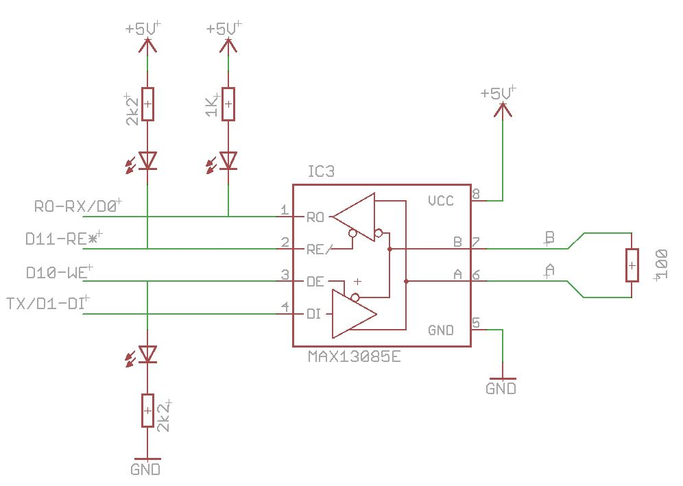

# Arduino RS485 control software

Michael Jonker 20141221

This project provides a software suite to support the use of an RS485 transceiver connected to the USART (Tx/Rx pins) in a half-duplex, concurrent multi-drop (i.e. multi-master, multi-slave) environment. For this purpose, the software suite has capabilities for message addressing and filtering as well as collision detection and avoidance.

### Hardware connection

An example of a hardware connection is given in Figure 1, which shows the connection of the RO, DI, RE* and DE lines of an RS485 transceiver to the Atmega/Arduino. Connecting the enable lines DE and RE* to separate pins of the Atmega/Arduino, gives the software full control over the communication via RS485.

**Figure 1**

The individual control of the RS485 enable lines allows for various modes of operation, including collision detection (requiring read while write) and exclusive communication over RS232 (requiring no read, as enabling read from RS485 mutes the regular RS232 reception). Furthermore, the RE* pull-up circuit will ensure that the RS485 read is disabled upon reset of the Atmega/Arduino; hence allowing program downloads in the usual way from the Arduino IDE. Note that, apart from this pull up resistor, all other extra components in the above diagram are optional. However, the presence of the LED to indicate the receive/transmit status of the RS485 will be very appreciated for diagnostics.

### Software capabilities

The software is implemented on top of a rewritten and backward compatible `SerialHardware` class and makes use of a few additional helper classes. As a result, methods like the `Serial.print()` can still be used unchanged.

The capabilities of this `SerialHardware` class can be extended with an (included) RS485 helper class to provide RS485 capabilities. With this helper class, communication can be switched between RS232 and various operational modes of the RS485 (full details are given below).

The capabilities can be further extended by a `MessageFilterRT` class. This message filter class provides message recognition and address filtering at the interrupt level. Due to possible large data traffic between various nodes on the half duplex multi-drop RS485 bus, and
given the limited capacity of the internal message buffer of the `HardwareSerial` class, there is a risk of message loss due to buffer flooding. The real-time filtering capability reduces this risk by pruning data not intended for the node, leaving the internal message buffer of the HardwareSerial class fully available for messages that are destined to the node.

It should be noted that message filtering in the presence of high bus occupancy will consume (real time) processing resources of the Atmega/Arduino. In a future version I may envisage to exploit the hardware addressing capabilities of the Atmega chip.

Collision avoidance is implemented through the assignment of node priority. A node will not start transmission before the bus has been idle for a time determined by the node priority. Collision detection is implemented by read-verified-write, i.e. all data written is checked on the fly for proper echo-back. If the software detects a frame error or a data mismatch when a character is received it will disable
the RS485 transmission and flag the collision status. In such a case it is left to higher software layers to retry sending the message.

#### Example code

The project further provides an example/demo sketch and instructions of usages.

As a demo the morse.ino file contains an Arduino sketch of a simple command response implementation capable of generating Morse messages, and switching between various communication modes. This sketch makes further use of a CommunicationParameteres class (included), which maintains the settings for the communication mode.

Besides the library `HardwareSerial_RS485`, there are two more libraries: Morse, which implements basic morse output class and `MessageFilter`, a client level message filter (in the current version this class is fully independent of the real time filter `MessageFilterRT`, in a future release this filter will reuse code `MessageFilterRT` implementation).

#### Host interface and software

Host (PC or Android) connection to the RS485 bus can be achieved by a RS485 to USB converter. As an example, the RS485-USB converter from FTDIchip ([FTDIchip Products USBRS485](http://www.ftdichip.com/Products/Cables/USBRS485.htm)) was used for development by the author. Another possible candidate could be the Sparkfun BOB-09822 breakout board [https://www.sparkfun.com/products/9822](https://www.sparkfun.com/products/9822). However, these solutions will not provide host-based collision detection and only a limited capability of host based collision avoidance. A project for a USB RS485 interface (discussed below) may provide these facilities.

Various applications exist to communicate with the RS485 nodes on the bus. For simple command responds testing, a simple terminal emulator such as Putty ([www.putty.org](http://www.putty.org/)) or FTDI UART terminal can be sufficient. More complex applications must be developed explicitly. (In a future post, the development of an Adroid specific application will be published.

## Detail software description

**Preamble:**
This project makes extensive use of template classes. The use of templates allows for a high degree of code configuration options that are resolved at compile time, leading to improved code performance. Template parameters are used to enhance functionality through supplied helper classes, and also for various configurable parameters, like buffer sizes, buffer overrun policy, RS485 enable wirings, etc.

The `HardwareSerial_RS485` library contains the following classes:

#### HardwareSerial_RS485 (.h and .cpp)

A library/project wrapper header file, which, besides including the specific class header files, also specifies the implementation details and options of the Serial object (for more detail see Serial object definition below).

#### HardwareSerial_RS485Enabled (.h)

The rewritten HardwareSerial class. This class is completely backward compatible with the classical HardwareSerial class provided in the Arduino project. This is a template class that by default does not provide additional functionality. Extensions are activated by passing
helper class specification through the template parameters.

#### HardwareSerial_RS485Helper (.h)

This header file contains the helper classes RS485serial and `MessageFilterRT`, which can be passed through template parameters into the HardwareSerial class to provide enhanced capabilities. The RS485serial class is itself implemented as a template class and takes as a parameter the TRxControl class (also included in this header file), which specifies the wiring of the RS485 enable lines to the Atmega/Arduino.

#### USARTdef (.h)

The purpose of the header file `USARTdef.h` is to provide ‘normalized’ definitions of the USART parameters for USARTn (where n=0 … 3). The code generates for each available USART a dedicated constant static class. These USART classes are used for the T__USART template parameter of the `HardwareSerial_RS485Enabled` template class.

#### BitManipulation (.h)

This header file provides template functions for type independent bit manipulation functions. This is a general purpose library that may serve various purposes also outside the `HardwareSerial` context. (It intends to push this to the Arduino project/community, if I can find out where).

#### Print (.h and .cpp)

As a bonus, this small enhancement of the original Print class, provided by the Arduino framework, provides some additional features for field size and padding control. Furthermore, using template technology, the code has been simplified, easing maintenance (without impact on efficiency). (I intends to push this to the Arduino project/community).

#### Serial object definition

Due to the complex structure of the `SerialHardware` class, the specification of the Serial object is given in a C macro inside the `HardwareSerial_RS485` header file. Through this mechanism, the extern declaration by the `HardwareSerial_RS485` header file and implementation in the cpp file can be made consistent without having to edit two different files.

The full syntax of the declaration is given by

    #define defined_SerialClass \  
    HardwareSerial<USART0                        /* USART to be used */ \
                   6,                            /* exponent of TX buffer (i.e. size 2≪6 */ \  
                   5,                            /* exponent of RX buffer (i.e. size 2≪5 */ \  
                   ' ',                          /* Data overrun marker (space for no markr) */ \  
                   RS485serial<TRxControl< > >,  /* RS485 extension */ \  
                   MessageFilterRT >             /* RT message filter */

    // NB the template parameters (and their default values) of TRxControl template class are given by:  

    TRxControl<’B’,         // port specification, either ’B’, ’C’ or ’D’  
               2,           // bit value (0..7) to enable TX  
               3 >          // bit value (0..7) to disable RX  
               // NB the complementary of a bit value ~(0..7), is interpreted as inverse enable levels.

    // the default parameters for HardwareSerial<> are  
       HardwareSerial&lt; /* no default */, 6, 6, ' ', RS485_dummy, MessageFilter_dummy>  
    // Where RS485_dummy and MessageFilter_dummy are two dummy classes which allow
    // for significant code optimisation in case these extensions are not needed
    // (hence producing a barebones HardwareSerial class).  

    // Other specifications examples:  
    #define defined_SerialClass HardwareSerial<USART0>;        // equals classical implementation  
    #define defined_SerialClass HardwareSerial<USART0, 6, 5, ' ', RS485serial< >, MessageFilterRT>
  

#### Implementation details

Due to the implementation of the USART parameters as a constant static class that are passed as a template parameter to the `HardwareSerial` class, the `HardwareSerial` class can handle only one USART per template instance. In case more than one Serial object is required for
systems with more than one USART, each Serial object will need its own instance of the template class. While for single USART devices the template based solution will lead to efficient and compact code (as many addresses can be resolved at compile time), for devices with several USART there is a code size penalty (however, not an execution speed overhead). This issue will be further investigated (and if needed resolved) in a future release.

## Future developments, things to do

The current version needs some ‘aesthetics’ improvement that addresses maintainability and code efficiency and it also misses some important parts. Furthermore, there is a need for related developments (either as part of this project or as an independent project). This section
outlines the developments (direct or related) that are currently foreseen on short and median long scale.

#### Implementation improvements

Apart from the various todo comments embedded in the current software, there are a few more global developments that are discussed here.

**_Compatibility with USB serial_**: The current implementation of the demo program is not compatible with ATmega32U4 based devices such as the Arduino Leonardo or Micro. Work is in progress.

**_HardwareSerial class definitions_**: In the current implementation the Serial class is defined in the header file `HardwareSerial_RS485.h`. The objective is to externalize the Serial class and object definition, possibly through inclusion of a definition file included from a ‘variant’ specific configuration directory.

**_RS485 as static class variable of HardwareSerial_**. Currently the `HardwareSerial` class subclasses the RS485serial class that is passed as a template parameter. On the one hand, this makes the public methods of the RS485serial class readily available to the users of the `HardwareSerial` class, most notably, the method to control the RS communication mode. On the other hand, the RS485serial object is, in this configuration, an instance field and not a class (aka static) field. Because of this the interrupt handlers of the `HardwareSerial` need to be
instance methods and not class methods.

In case RS485serial class is implemented as a static field in the `HardwareSerial` class, then the later should provide a ‘relay’ method to give access to the control method of the RS485serial class.

Related to this, the linking of interrupt vectors and friendship declarations may become simpler. To be investigated: the option to dynamically link the interrupt handlers to the interrupt vectors. Should the interrupt vectors be hooked to interrupt handlers in the USART classes, which can be relayed to the static methods of `HardwareSerial`.

**_USART class definitions_**. Test for completeness of all configurations.

#### New developments

The subsection describes new development in relation to this project.

**_Message oriented transmission support:_** The current implementation does not provide built-in support for message oriented data transmission yet. It is proposed to add at least two methods: 

    unsigned char openMessage(char* header, unsigned char options=0);
    unsigned char closeMessage(unsigned char options=0);

The method openMessage() will set up a header with destination address to encapsulate the subsequent calls to Serial.print(). It will store the `HardwareSerial` transmit buffer position of the message start.

If during any subsequent calls to Serial.print() an error of any sort is detected, then the complete message transmission will be retried, provided that the full message is still inside the buffer. However, once the accumulated message length has exceeded the `HardwareSerial` transmit buffer size, the message can no longer be retried and subsequent message data will be discarded. The user is informed in this case through the return status of closeMessage(), leaving it up to the user to decide whether to recreate and resend the message or not.

It is to be investigated, whether these methods are better implemented in the `HardwareSerial` class, in a class that extends (subclasses) `HardwareSerial`, or whether these methods should be implemented as part of an independent class that is dynamically linked to the
`HardwareSerial` class.

**_Refactor the `MessageFilter` and `MessageFilterRT` classes:_** The `MessageFilter` implementation (`MessageFilter.h`) was a precursor to the `MessageFilterRT` class, but provides additional functionality (i.e. message presence test, address extraction, message extraction). However, the filter part proper should (re)use the code of `MessageFilterRT`.

**_Relaxation of collision avoidance delay in reply messages:_** Provide an option to a slave to reply without the priority based collision avoidance delay. Note that this may cause problems if a master sends an uninterrupted sequence of requests to several slaves. In this case all addressed slaves may report simultaneously, which will result in a message collision.

**_Improvement of collision avoidance:_** Currently, bus occupancy is detected after the transmission of the first character. Using a level change interrupt, the bus occupancy can be detected as soon as the start bit of the first data item is transmitted onto the bus. Such an option will reduce the likelihood for collisions; furthermore, the enforced priority based idle time can be increased. Only worries are the
resource usage (can be avoided by disabling the interrupt after first level change detection?). Investigate whether the USART state can tell us if a reception is in progress.

**_Hardware implemented address filter:_** The current implementation reads all character transmitted on the bus to filter the messages that correspond to its addresses. In case of high bus occupancy, this implies a loss of processing resources for this filtering. A future implementation could make use of the capability of the Atmega to recognize special 9-bit address frames on the bus. However, this should then be supported by all devices on the RS485 bus, including the host device.

**_Implementation of collision and filter inside RS485 – USB device:_** The current RS485 host interfaces (FTDIchip, Sparkfun), provides poor support for collision detection and collision avoidance. In essence, the host application does not have immediate knowledge of the bus occupancy, which makes collision avoidance at the character level impossible. The FTDIchip converter provides some options for collision detection as the chip can be configures in local read back mode. The host software can check whether the messages read back, matches the
expected echo of the messages sent. The Sparkfun BOB-09822 breakout board (based on the same FT232 chip from FTDIchip) does not provide required control of the enable lines TE and RE* as these two lines are connected together in hardware. This makes collision detection impossible without modification of the hardware.

An adaptation of the local firmware in the FTDI interface could be considered. However, FTDI does not provide off-hand support for modifying the local firmware. Moreover, the adaptation of this firmware is most likely not an easy task.

The preferred solution is to make a new interface/gateway based on an Arduino Micro (which deploys the ATmega32U4 chip) in conjunction with an RS485 transceiver. The current software can be used to implement a USB - RS485 converter with collision detection and collision avoidance. A second option is to use the Atmega16U2 chip. The same chip is also used on the Arduino boards for the USB interface. The source of
the firmware is available; however, the adaptation of this software is most likely more complex. Also the hardware implementation will be more complex to realize.

**_Supervisor communication application:_** A host supervisor communication application, running on Android, which can interact with the slaves and record the full network traffic, will be published as an independent project.

 

> Michael Jonker, ERPID = {52.36040, 4.87001, NAP+5m, 1954:128.621}